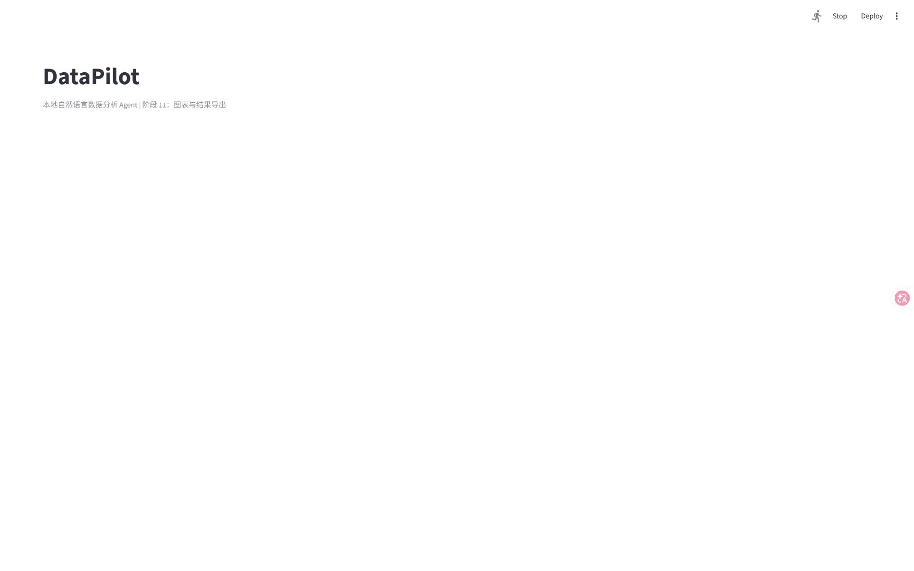

# DataPilot：本地自然语言数据分析 Agent

> 当前状态：阶段 11 功能与测试已完成；已记录模型、PNG 导出、SQL 安全、报告引用和演示环境的真实失败案例，并保存首页运行截图。完整上传后的结果截图仍需在外置浏览器中手动完成，不能用当前截图替代。



> 截图说明：这是本地 Streamlit 首页截图，只用于证明页面可以打开；由于外置浏览器的系统文件选择器阻断了自动上传，本图不包含上传数据后的图表和报告。

## 项目定位

DataPilot 是面向中文电商经营数据的本地自然语言分析工作台。用户上传 CSV 或 XLSX 文件后，可以用中文提问，系统由本地 Ollama 模型生成结构化分析计划，再经过 Pydantic、字段白名单和只读 SQL 校验，按计划执行受控工具，并根据真实结果生成中文报告、图表和可下载文件。

这个项目与作品集中的 LearningHub 不同：LearningHub 重点是中文文档的 Embedding 检索、来源约束问答和笔记管理；DataPilot 重点是结构化数据分析、Agent 工具调用、SQL 安全和结果可追溯。

## 参考来源

本项目参考并改造：

- [`Shubhamsaboo/awesome-llm-apps`](https://github.com/Shubhamsaboo/awesome-llm-apps)
- 上游示例路径：`starter_ai_agents/ai_data_analysis_agent`

参考项目使用 Streamlit、Agno、OpenAI 模型、DuckDB、Pandas，实现 CSV/Excel 上传和自然语言数据分析。本项目不会直接声称复刻项目已经完成，而是按计划逐步替换为中文业务样例、本地 Ollama、结构化计划、受控工具和测试验证。

## 目标技术链路

```text
中文问题
  -> Ollama 本地模型生成 JSON 分析计划
  -> Pydantic 校验工具和参数
  -> 受控工具执行 DuckDB 只读查询或统计
  -> 记录工具结果和数据证据
  -> 本地模型生成中文报告
  -> 表格、图表和 Markdown/CSV/PNG 导出
```

## 当前能力

- CSV/XLSX 文件读取、编码处理、列类型识别和输入限制。
- 行列概览、字段类型、缺失值、重复值和异常值检查。
- DuckDB 临时表和只读 SQL 查询。
- 危险 SQL、多语句、未知表名和超限结果拦截。
- 页面内置中文查询示例，可查看查询状态、耗时、返回行数和执行 SQL。
- Pydantic 参数校验和工具执行记录。
- 数据概览、分组统计、IQR 异常检测和柱状图/折线图/饼图结构化配置工具。
- Ollama 本地模型发现、embedding 模型过滤、模型选择和真实聊天测试。
- 结构化分析计划生成、Markdown/额外文本 JSON 提取、ASCII 字段别名映射和一次自动修复。
- 计划通过 Pydantic、工具参数、字段白名单和 SQL 只读校验后才展示，校验失败不会执行工具。
- 按已校验计划顺序执行数据概览、只读 SQL、分组统计、异常检测和图表配置工具，任一步失败会停止后续步骤。
- 把成功工具结果作为唯一报告证据，使用本地 Ollama 生成中文报告；报告 JSON 不合格或模型不可用时只返回安全降级说明。
- 使用 Plotly 渲染柱状图、折线图和饼图；图表只接收结构化 `ChartSpec`，不执行模型生成的 JavaScript。
- 支持工具结果 CSV、图表 CSV、Markdown 报告和 PNG 导出；Plotly/Kaleido 失败时使用 Pillow 生成静态 PNG 并提示实际后端。
- 提供覆盖总量、分组、趋势、异常、组合条件、图表、无关和不可回答问题的 20 条固定评估集，并按工具、字段、拒答状态和图表类型评分。
- 记录 `qwen3:4b` 结构化计划不稳定、Kaleido PNG 导出失败、Ollama 服务异常、非法 SQL 拦截、报告引用校验和外置浏览器文件选择器限制，详见 [`docs/failure-cases.md`](docs/failure-cases.md)。

## 后续计划

- 使用外置浏览器手动完成一次样例数据上传后的完整演示截图；在此之前只使用当前首页截图，不扩大截图结论。
- 完成阶段 16 的项目独立复述和简历准入问答。

## 当前暂不支持

- 云端 OpenAI API 默认调用。
- 任意 Python 代码执行。
- 任意写入型 SQL、真实企业数据库和生产数据接入。
- 多用户权限、登录、分布式部署和实时数据同步。
- 尚未实现的能力不会写入完成状态，也不会提前写入简历。

## 当前样例数据

`data/sample_ecommerce.csv` 和 `data/sample_ecommerce.xlsx` 是固定种子生成的合成订单数据，共 243 行、13 个字段。数据说明和质量场景记录在 [`data/README.md`](data/README.md)。

重新生成样例文件：

```powershell
.\.venv\Scripts\python.exe scripts\generate_sample_data.py
```

## 开发计划

完整的阶段目标、文件产物、验收标准和禁止事项记录在：

- [`DataPilot 项目严格执行计划`](https://github.com/san31415926/ai-application-portfolio-lab/blob/main/docs/datapilot-project-plan.md)
- [`技术决策记录`](https://github.com/san31415926/ai-application-portfolio-lab/blob/main/docs/decision-log.md)

开发顺序固定为：上游拆解 -> 项目骨架 -> 样例数据 -> 数据读取 -> 质量检查 -> SQL 安全 -> 工具 -> Ollama -> 结构化 Agent -> 报告和图表 -> 界面 -> 测试评估 -> 文档和面试复述。

## 运行说明

在项目目录中创建独立虚拟环境并安装依赖：

```powershell
python -m venv .venv
.\.venv\Scripts\python.exe -m pip install -r requirements.txt
```

启动阶段 11 工作台：

```powershell
.\.venv\Scripts\python.exe -m streamlit run app.py
```

如果页面提示 Ollama 不可用，请先确认本机服务和模型：

```powershell
ollama serve
ollama pull qwen2.5:3b
```

页面侧边栏的“检测已安装模型”会读取本机模型列表；选择生成模型后可以点击“测试本地模型”验证真实调用。`embeddinggemma:300m` 只用于向量 embedding，不会进入生成模型选项。

检查固定评估集结构：

```powershell
.\.venv\Scripts\python.exe scripts\run_evaluation.py
```

对模型输出评分时，使用 `--plans` 传入按 `case_id` 保存的结构化计划 JSON；评分只表示计划契约是否满足预期，不代表中文表达质量或业务预测准确率。

运行测试：

```powershell
.\.venv\Scripts\python.exe -m unittest discover -s tests -v
```

阶段 2 已验证：依赖可以安装和导入，配置测试 3 项通过，Python 语法检查通过，Streamlit 健康检查返回 `200 ok`。阶段 3 已验证：固定种子可复现，CSV/XLSX 内容一致，样例数据测试 3 项通过。阶段 4 已验证：完整测试集 14 项通过，支持 UTF-8/GBK 类编码、CSV/XLSX、表头清洗、日期/数值/文本类型识别、原始值保留和转换失败行记录；页面加载错误只显示中文原因。阶段 5 已验证：页面增加行列概览、缺失单元格、重复行、重复标识、字段角色、唯一值和数值范围展示；样例数据质量报告识别出 2 个缺失单元格、1 行重复记录和 1 个重复标识。阶段 6 已验证：新增 DuckDB 只读查询引擎、SQL 校验、查询超时、最大行数和结果大小限制，并接入中文工作台；完整测试集 30 项通过，包含上传 CSV 后执行默认查询的页面流程测试。阶段 7 已验证：新增 Pydantic 工具输入/输出模型、工具字段白名单、IQR 异常检测、分组统计、数据概览、图表结构化配置和工具执行记录；完整测试集 37 项通过。阶段 8 已验证：新增 Ollama HTTP 客户端、生成模型过滤、超时和错误码处理，并接入侧边栏模型检测和真实测试按钮；完整测试集 42 项通过。本机真实验收发现 3 个生成模型，`qwen2.5:3b` 成功返回模型回答。阶段 9 已验证：新增结构化分析计划模型、JSON/代码块解析、ASCII 字段别名映射、工具参数和 SQL 只读校验、一次自动修复以及 `think=false` 计划请求；完整测试集 53 项通过，`compileall` 和 `git diff --check` 通过。`qwen2.5:3b` 在低温度结构化请求下连续生成合法计划，失败计划仍会被拦截。阶段 10 已验证：新增计划二次校验执行、工具执行记录、成功证据裁剪、中文报告 JSON 校验和安全降级；完整测试集 62 项通过，`compileall` 和 `git diff --check` 通过。真实 Streamlit 页面完成“检测模型 -> 上传样例 CSV -> 生成计划 -> 执行分组统计 -> 生成中文报告”链路，无异常。`qwen3:4b` 已列入可选模型，但当前计划输出稳定性不足，不作为阶段 10 的稳定验收模型。

阶段 11 已验证：新增结构化 Plotly 图表渲染、CSV/Markdown/PNG 导出、Pillow PNG 降级、20 条固定中文评估集和边界测试；完整测试集 72 项通过，`compileall` 和 `git diff --check` 通过，Streamlit 健康检查返回 `200 ok`。固定评估集结构检查脚本已通过；失败案例记录和演示截图尚未完成。

已知限制：当前 Windows 环境中 Plotly 5.24.1 调用 Kaleido 0.2.1 仍可能出现启动错误；系统会捕获该失败并使用 Pillow 生成有效 PNG，同时提示用户实际使用的后端。不能把所有环境都表述为 Plotly 原生 PNG 导出稳定可用。
