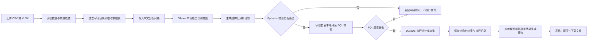

# DataPilot：本地自然语言数据分析助手

DataPilot 是一个面向 CSV/XLSX 文件的本地 AI 数据分析工作台。用户上传表格后，可以直接使用中文提问，例如“哪个地区销售额最高？”或“谁没有出勤？”。系统先让本地模型理解问题，再通过受控工具查询数据，最后生成中文报告、图表和可下载结果。

项目重点是让模型负责“理解问题和制定计划”，让程序负责“校验计划、查询数据和生成真实结果”，避免模型直接编写并执行不受控制的代码或 SQL。

## 项目能力

| 模块 | 功能 |
| --- | --- |
| 数据导入 | 支持 CSV、XLSX，处理常见编码并识别日期、数值和文本字段 |
| 数据质量 | 展示行列数量、缺失值、重复行、重复标识、唯一值和数值范围 |
| 中文分析 | 用自然语言描述分析目标，支持总览、分组统计、趋势、明细和异常分析 |
| 本地模型 | 接入 Ollama，可检测、选择并测试本机生成模型 |
| 安全查询 | 使用 Pydantic、字段白名单和 DuckDB，只允许查询当前上传的数据 |
| 报告图表 | 生成中文分析报告，渲染柱状图、折线图和饼图 |
| 结果导出 | 支持导出工具结果 CSV、图表 CSV、Markdown 报告和 PNG 图片 |
| 练习数据 | 内置 10 组中文合成数据，共 20 个 CSV/XLSX 文件 |

## 系统流程



完整流程图文件见 [`docs/flowchart.md`](docs/flowchart.md)。

## 技术架构

```text
Streamlit 页面
    -> 数据加载与质量检查
    -> OllamaClient：调用本地模型
    -> QueryIntent / AnalysisPlan：约束问题理解和分析计划
    -> Pydantic 参数校验
    -> SQLGuard：只读 SQL 和数据源校验
    -> DuckDB：执行当前上传数据的查询
    -> Plotly：渲染结构化图表
    -> Markdown / CSV / PNG：导出结果
```

技术栈：Python、Streamlit、Ollama、Pandas、DuckDB、Pydantic、Plotly、openpyxl、unittest。

## 一键启动

运行环境：Windows、Python 3.11 及以上、Ollama。

首次使用前，请确认 Ollama 已安装。双击项目目录中的 `start_datapilot.bat`，脚本会自动完成以下工作：

1. 创建 `.venv` 虚拟环境。
2. 安装 `requirements.txt` 中的依赖。
3. 检查 Ollama 服务；未启动时尝试启动。
4. 检查并准备 `qwen2.5:3b` 模型。
5. 启动 Streamlit 页面，并显示实际访问地址。

也可以在 PowerShell 中执行：

```powershell
.\start_datapilot.bat
```

启动后打开：

```text
http://127.0.0.1:8502
```

如果 8502 端口已经被占用，脚本会自动选择下一个可用端口，并在终端显示地址。

## 手动启动

如果不使用一键脚本，可以按以下步骤操作：

```powershell
python -m venv .venv
.\.venv\Scripts\python.exe -m pip install -r requirements.txt
ollama serve
ollama pull qwen2.5:3b
.\.venv\Scripts\python.exe -m streamlit run app.py --server.port 8502
```

`embeddinggemma:300m` 仅用于向量 embedding，不会作为报告生成模型显示。DataPilot 的主要分析模型推荐使用 `qwen2.5:3b`。

## 使用步骤

1. 在“数据选择”中选择内置练习数据，或上传自己的 CSV/XLSX 文件。
2. 查看数据概览和质量检查结果，确认字段是否被正确识别。
3. 在侧边栏检测本地模型，选择生成模型并进行测试。
4. 输入中文问题，例如：

   - 哪个地区的销售额最高？
   - 各个渠道的订单数量是多少？
   - 哪些商品库存低于安全库存？
   - 谁没有出勤？

5. 查看分析计划、工具执行结果、中文报告和图表。
6. 根据需要下载 CSV、Markdown 或 PNG 结果。

## 测试结果

当前测试和代码检查结果：

- `83` 个 unittest 全部通过。
- `compileall` Python 语法检查通过。
- `git diff --check` 格式检查通过。
- 覆盖数据加载、CSV/XLSX 解析、数据质量、意图识别、计划校验、只读 SQL、工具执行、图表、导出、Ollama 客户端和 Streamlit 页面流程。

运行测试：

```powershell
.\.venv\Scripts\python.exe -m unittest discover -s tests -v
```

运行固定评估集结构检查：

```powershell
.\.venv\Scripts\python.exe scripts\run_evaluation.py
```

## 常见问题

### 1. 页面可以打开，但提示本地模型不可用

确认 Ollama 服务正在运行，并检查模型是否已经安装：

```powershell
ollama serve
ollama list
ollama pull qwen2.5:3b
```

### 2. 为什么不能让模型直接执行任意 SQL？

模型只负责生成结构化分析计划。程序会先校验字段、工具参数、表名和 SQL 类型，只允许对当前上传的数据执行单条只读查询，避免修改数据或访问外部数据源。

### 3. 为什么有些问题没有结果？

可能是当前文件没有对应字段、筛选条件没有匹配记录，或问题超出了当前数据的内容。请先查看“字段详情”和“数据样例”，再根据实际字段重新提问。系统不会在没有数据证据时编造结果。

### 4. 为什么 `qwen3:4b` 的结果不如 `qwen2.5:3b` 稳定？

不同本地模型对结构化 JSON 输出的稳定性不同。当前项目默认使用 `qwen2.5:3b` 完成分析计划和报告生成，其他模型可以在页面中测试后再使用。

### 5. 项目会把上传的数据发送到云端吗？

不会。数据读取、查询和模型调用默认在本机完成，示例文件也全部是固定种子生成的合成数据，不包含真实企业数据。

### 6. 项目支持修改原始数据吗？

不支持。当前版本只做数据读取、统计、分析和结果导出，不执行写入型 SQL，也不修改上传文件。

## 数据说明

`data/sample_ecommerce.csv` 和 `data/sample_ecommerce.xlsx` 是固定种子生成的合成电商订单数据，共 243 行、13 个字段。

`data/practice/` 提供 10 组中文练习数据，每组同时包含 CSV 和 XLSX，主题包括电商订单、商品库存、门店销售、广告投放、客户复购、物流时效、员工考勤、培训成绩、家庭收支和网站访问。

重新生成练习数据：

```powershell
.\.venv\Scripts\python.exe scripts\generate_practice_data.py
```

## 项目边界

当前版本定位为本地可运行原型，暂不包含登录、多用户权限、分布式部署、实时数据库同步和云端模型服务。项目中的示例数据仅用于功能演示和测试验证。
