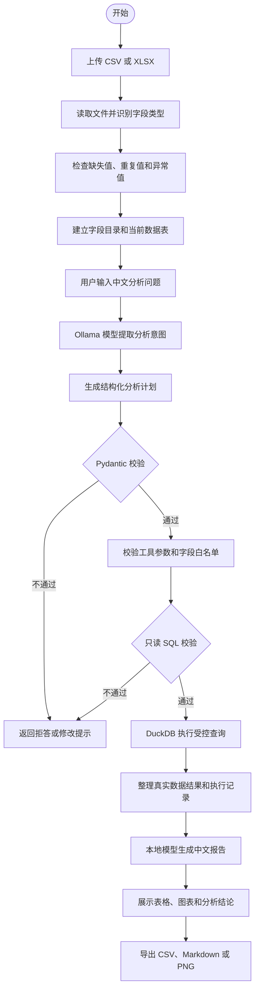

# DataPilot 系统流程图

## 主流程

## 各模块职责

| 模块 | 负责内容 |
| --- | --- |
| 数据加载 | 读取 CSV/XLSX，处理编码、表头和基础类型 |
| 数据质量 | 检查缺失、重复、唯一值、数值范围和异常记录 |
| 意图识别 | 把中文问题转换为目标、维度、指标、聚合和筛选条件 |
| 计划校验 | 使用 Pydantic 限制计划结构和字段引用 |
| 安全查询 | 只允许访问当前数据，执行单条只读 SQL |
| 工具执行 | 完成总览、分组统计、异常检测和图表配置 |
| 报告生成 | 仅根据已执行工具返回的真实结果生成中文报告 |
| 页面展示 | 展示分析过程、表格、图表和下载文件 |
